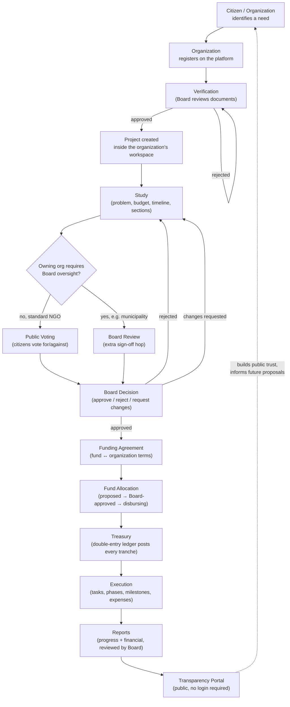

# Business Flow — The Governmental / Civic Process

> **Audience:** Government stakeholders, municipality staff, NGO partners, Board members, auditors, project managers.
> **Purpose:** Explain *why* each step of HelpingHands' process exists, in the order money and authority actually move — not just what button to click.
> **Grounding:** Every step below maps to a concrete implemented mechanism (workflow definition, guard, table). Where the platform does not yet enforce something described here, it is marked **NOT IMPLEMENTED**.

---

## 1. The end-to-end flow at a glance



---

## 2. Step by step: what happens and why

### 2.1 Citizen / Organization

**What happens:** A need is identified — a water shortage, a school in disrepair, a group of youth wanting to run a community program. Someone represents that need on the platform: either an individual donor/participant browsing and funding existing projects, or an **Organization** (NGO, municipality, youth team, or initiative) proposing new work.

**Why this step exists:** The platform does not itself decide what work is needed — that decision stays with the people closest to the problem. The platform's job starts at the next step: turning a proposal into something accountable.

**Implemented as:** `Participant` (individual donor account, self-registers at the public site) and `Organization` (`type ∈ {ngo, municipality, youth_team, initiative}`) are both first-class entities. See `SYSTEM_ARCHITECTURE.md` §4.2 and §9.

---

### 2.2 Organization registration

**What happens:** An organization submits itself to the platform — name, type, registration number, and (for government entities) official documents.

**Why this step exists:** Before an organization can execute projects, spend fund money, or appear on the public Transparency Portal, its identity needs to be established. This is the entry point to accountability, not a bureaucratic formality: everything downstream (capabilities, Board oversight requirements, fund eligibility) is attached to this organization record.

**Implemented as:** Two paths —
- **Self-service** (`POST /organizations/register`, public admin-app page `/register`): gated by the `ORG_SELF_REGISTRATION` flag (`off` / `allowlist` / `open` — currently `allowlist` in `.env.example`, meaning only pre-approved contact emails can self-register during the pilot). Only `municipality` and `youth_team` types are self-registrable this way.
- **Direct creation** by a platform Administrator, from the Organizations page.

Either way, the organization starts in `pending_verification` status. Default capabilities (`canExecuteProjects`, `canReceivePublicFunds`, `canOpenDonations`, `isGovernmentEntity`, `requiresBoardOversight`) are set by type but adjustable by the Board per-organization — capability changes are audited.

---

### 2.3 Verification

**What happens:** The Board reviews the organization's submitted documents and either verifies it (moving it toward `active` status) or rejects it.

**Why this step exists:** This is the platform's core accountability guarantee: **no organization spends public or donated money without a documented, decision-logged review.** A municipality claiming government status, or an NGO claiming it can receive public funds, must have that claim checked by an accountable body — not self-asserted.

**Implemented as:** The `org-verification` workflow definition: `submitted → under_review → verified → active` (or `rejected`), gated on `{type: "documents_present"}` (official registration documents on file) **and** a Board `approved` decision. This is not optional or bypassable — the workflow engine will not advance the organization's state without both conditions.

---

### 2.4 Project creation

**What happens:** Once active, the organization creates a Project inside its own workspace: a name, a civic category (from a shared taxonomy — infrastructure, education, healthcare, social support, etc.), an owning organization (itself, auto-filled), a **fund of record**, and optionally one or more **participating organizations** for joint projects (e.g. a municipality as `executing_agency`, a partner NGO as `funding_partner`).

**Why this step exists:** A project is the unit of accountable public work — everything else (studies, votes, money, execution, reports) hangs off this one record, which is why it captures ownership and participation up front rather than as an afterthought.

**Implemented as:** `Project` + `ProjectParticipation` (`role ∈ {owner, executing_agency, funding_partner, supervising, beneficiary_rep}`). Joint projects use project-scope `RoleAssignment` grants so a partner organization's staff can work on exactly one shared project without joining the owning organization.

---

### 2.5 Study

**What happens:** The organization writes the formal justification for the project: problem statement, objectives, budget breakdown, timeline, and supporting documents — organized into sections (some auto-suggested from a department template matched to the project's category).

**Why this step exists:** Money should not move, and the public should not be asked to vote, on a one-line project title. The Study is the documented case for *why this specific spend, this amount, in this timeframe* — it is what a citizen reviews before voting, and what the Board reviews before approving funding.

**Implemented as:** `ProjectStudy` (draft → in_review → published → voting_open → voting_closed → approved/rejected) + `StudySection` (with per-section assignment, file attachments, completion tracking) + `StudyDepartmentTemplate` (category-matched section suggestions).

---

### 2.6 The fork: Public Voting vs. Board Review

**What happens:** Once a study is published, one of two paths applies, decided by the *owning organization's* `requiresBoardOversight` capability flag — not by project category or manual choice:

- **Standard path** (most NGOs): the study opens to **public voting**. Any authenticated user may cast a for/against/abstain vote with an optional comment during the voting window.
- **Municipal / government path**: the study instead routes through an additional **`board_review`** state before it can be approved — no public vote is required (though the underlying study/voting mechanics are the same generalized system).

**Why this step exists:** Public voting gives citizens direct say over community-funded work — the platform's core "citizen proposes or watches, an accountable body reviews" promise. Government-entity projects add a governance checkpoint appropriate to public-sector accountability requirements, without needing separate code paths — it's the same workflow engine running a different, data-defined version of the same lifecycle (`project-lifecycle` v2 vs. v1).

**Implemented as:** `VoteRound` + `Vote` (generalized voting, not study-specific) and the `project-lifecycle` v2 workflow definition's `board_review` state. See `SYSTEM_ARCHITECTURE.md` §5.

---

### 2.7 Board Decision

**What happens:** The Board — via its review queue — approves, rejects, or requests changes on the study/project, always with a **mandatory written rationale**.

**Why this step exists:** This is the platform's single most important accountability record. A decision without a stated reason is not accountable; a decision that can be silently edited later is not trustworthy. Every Board decision is therefore immutable and permanently visible (internally, and — for the decision registry fields — on the public Transparency Portal).

**Implemented as:** `BoardDecision` (`decision ∈ {approved, rejected, changes_requested}`, `rationale` required, never updated or deleted — corrections are new decisions). Consumed as a hard workflow guard: the project's lifecycle literally cannot advance past this point without a matching decision row.

---

### 2.8 Funding Agreement

**What happens:** For projects funded (in whole or part) by a managed Fund rather than only public donations, the Board and the organization establish a **Funding Agreement**: which fund, what terms (e.g. whether overdue reports block further disbursement, grace days), and what reporting schedule (monthly/quarterly progress and/or financial reports) applies.

**Why this step exists:** This is the specifically *municipal* funding channel — the formal, documented relationship between a public fund and the organization executing work with its money, with built-in leverage (disbursement holds) to keep reporting honest. It is what turns "a municipality received money" into an auditable, terms-bound relationship rather than a one-off transfer.

**Implemented as:** `FundingAgreement` (`draft → active → suspended/completed/terminated`), referenced by `FundAllocation.fundingAgreementId`, and by `OrganizationReport.fundingAgreementId` for obligation tracking.

---

### 2.9 Fund Allocation

**What happens:** A Fund officer proposes an allocation of a specific amount from a Fund to a Project. The Board decides (approve/reject). Once approved, money is released in tranches (`disbursing`), then the allocation is `reconciled` and finally `closed`.

**Why this step exists:** Funds are pooled money with their own governance (officers, spending limits, dual-approval thresholds) — separate from any single project's donations. This stage is where "the Fund decided to finance this project" becomes a traceable, approved, staged commitment rather than a single opaque transfer.

**Implemented as:** `FundAllocation` (`proposed → board_approved → disbursing → reconciled → closed`), running on the `fund-allocation` workflow definition, `approvedByDecisionId → BoardDecision`. Multiple allocations (even from multiple funds) can finance one project — the project's account credit history shows exactly which fund financed what.

---

### 2.10 Treasury

**What happens:** Every movement of money — a donor's approved cash donation, a completed online payment, a fund's disbursed tranche, a project's approved expense — is posted as a **double-entry ledger transaction**: paired debit/credit entries that always sum to zero, against named accounts (fund accounts, project accounts, provider clearing accounts, external counterparties).

**Why this step exists:** "Traceability of every financial transaction" is not achievable with a mutable free-form journal (the platform's original `ProjectTransaction` table). A double-entry ledger, written by exactly one module and never edited (only reversed by a new correcting entry), is what makes every later step — reconciliation, reporting, the public money trail — provably correct rather than merely reported.

**Implemented as:** `Account` / `LedgerTransaction` / `LedgerEntry` (see `SYSTEM_ARCHITECTURE.md` §6). Donors and staff never interact with the ledger directly — it is populated automatically from donation-approval and disbursement events.

---

### 2.11 Execution

**What happens:** The organization breaks the project into **Tasks**, **Phases**, and **Milestones**, updating status as work proceeds (pending → in progress → completed), and records **Expenses** against the project's budget as money is actually spent (each expense itself going through a pending → approved/rejected step).

**Why this step exists:** Funding a project is not the same as delivering it. This stage is the operational record — what work happened, when, and what it cost — that later Reports and the Transparency Portal's progress percentage are built from.

**Implemented as:** `ProjectTask`, `ProjectPhase`, `ProjectMilestone`, `ProjectBudget`, `ProjectExpense`. Project `progression` (0–100%) recalculates automatically whenever a donation is approved or a fund tranche is disbursed.

---

### 2.12 Reports

**What happens:** The organization submits formal **progress** and/or **financial** reports on its project(s), either ad hoc or on the schedule set by its Funding Agreement. The Board reviews each submission: **accept** it, or **return** it with mandatory comments for revision and resubmission.

**Why this step exists:** Money moving to an organization creates an ongoing obligation to account for its use — not just at the moment of allocation, but throughout execution. A Funding Agreement configured to block further disbursement on overdue reports gives this obligation real weight rather than being a paperwork suggestion.

**Implemented as:** `OrganizationReport` (`type ∈ {progress, financial}`, one lifecycle: `submitted → under_review → accepted | returned`). Obligations (what's due, and whether it's overdue) are *computed* from the Funding Agreement's `reportingSchedule` — not manually tracked. A daily sweep flags overdue reports and, per agreement terms, can hold disbursements.

---

### 2.13 Transparency Portal

**What happens:** Anyone — no login required — can visit the public portal and see, for any project: where the money came from (cash/QR donations, online donations, fund allocations, broken down by channel), which fund paid for what, the full Board decision history with rationale, and the same live progress percentage shown internally. Fund and organization pages show intake/allocation/spend and portfolio history respectively, each with a downloadable CSV statement.

**Why this step exists:** This is the payoff of every prior step: a citizen (or auditor, or journalist, or donor) can independently verify the entire chain — proposal → review → funding → spend — without asking anyone for access. It is also what closes the loop back to step 2.1: a transparent track record is what earns the public's trust (and future donations) for the *next* proposal.

**Implemented as:** The `transparency` module's read layer (cached aggregates over ledger/workflow/governance/category data, 60-second TTL with event-driven invalidation) plus a Board-controlled `PublicationPolicy` table that decides which field classes are public, workspace-only, or permanently excluded (beneficiary personal data is hard-excluded at the query level, not merely policy-gated). See `SYSTEM_ARCHITECTURE.md` §8.

---

## 3. Two concrete paths through the flow

### 3.1 A standard NGO project (public voting path)

```mermaid
sequenceDiagram
    participant NGO as NGO (org_admin)
    participant Public as Citizens
    participant Board
    participant Donor as Public Donor
    NGO->>NGO: Create project + study (draft)
    NGO->>NGO: Submit → in_review → publish
    NGO->>Public: Study opens for voting
    Public->>Public: Cast votes (for/against/abstain)
    NGO->>Board: Close voting, request decision
    Board->>Board: Approve (mandatory rationale)
    NGO->>Public: Donations open
    Donor->>NGO: Cash (QR) or online donation
    NGO->>NGO: Staff approves cash donation → ledger posts credit
    NGO->>NGO: Progress auto-updates; execution begins at 100% funded (or per policy)
    NGO->>Public: Reports optional unless tied to a Funding Agreement
    Public->>Public: Views project on Transparency Portal at any time
```

### 3.2 A municipal infrastructure project (Board-oversight + fund path)

```mermaid
sequenceDiagram
    participant Muni as Municipality (org_admin)
    participant Board
    participant Fund as Fund officers
    Muni->>Board: Register organization (municipality)
    Board->>Muni: Verify + activate (capabilities incl. requiresBoardOversight)
    Muni->>Muni: Create project (fund of record set, partner NGO added as participant)
    Muni->>Muni: Create + publish study
    Muni->>Board: send_to_board (board_review state — no public vote required)
    Board->>Muni: Approve (mandatory rationale)
    Board->>Muni: Sign Funding Agreement (reporting schedule, disbursement terms)
    Fund->>Board: Propose allocation
    Board->>Fund: Approve allocation
    Fund->>Fund: Disburse tranche(s) → Treasury posts fund→project ledger entries
    Muni->>Muni: Begin execution directly (no public donations station, per v2 workflow)
    Muni->>Board: Submit progress/financial reports on schedule
    Board->>Muni: Accept (or return with comments — blocks further disbursement if overdue)
    Public: Views full money trail + decision history on Transparency Portal
```

---

## 4. Roles at each stage

| Stage | Who acts | System role(s) |
|---|---|---|
| Organization registration | Org's contact person, or a platform Administrator | none yet (pre-account) / `administrator` |
| Verification | Board | `board_chair` / `board_member` (decision), `administrator` acting as Board Chair by default grant |
| Project / Study creation | Organization staff | `org_admin`, `project_manager`, `staff` |
| Public voting | Any authenticated citizen | `participant` |
| Board Review / Decision | Board | `board_chair`, `board_member` |
| Funding Agreement | Board + Fund officers | `board_chair`, `fund_director` |
| Fund Allocation propose/approve/disburse | Fund officers, Board | `fund_director`, `fund_deputy`, `fund_accountant` (segregated by step — see `SYSTEM_ARCHITECTURE.md` §6) |
| Execution (tasks/expenses) | Organization staff | `project_manager`, `staff`, `org_accountant` |
| Cash donation approval | Platform/org staff | `employee`, `staff`, `org_accountant` |
| Report submission | Organization staff | `org_admin`, `staff` |
| Report review | Board | `board_chair`, `board_member`, `board_secretary` |
| Transparency Portal viewing | Anyone | none (public, no login) |

---

## Related documents
- `USER_MANUAL.md` — the same flow, explained screen-by-screen for each workspace.
- `DEMO_SCRIPT.md` — this flow performed live in a ~35-minute walkthrough using the seeded demo data.
- `SYSTEM_ARCHITECTURE.md` — the technical mechanisms (workflow engine, ledger, policy engine) behind each step.
