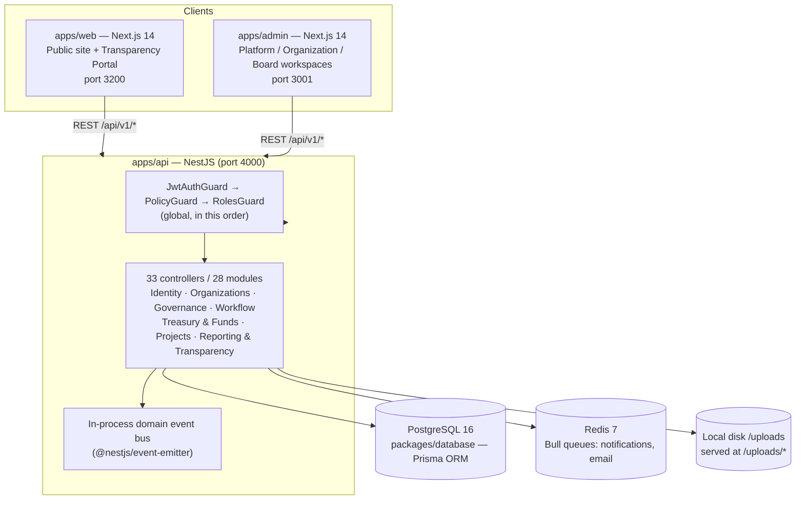
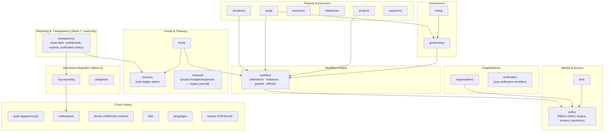
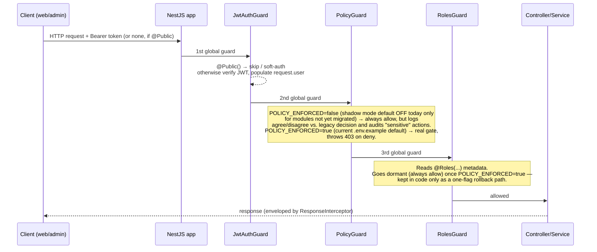
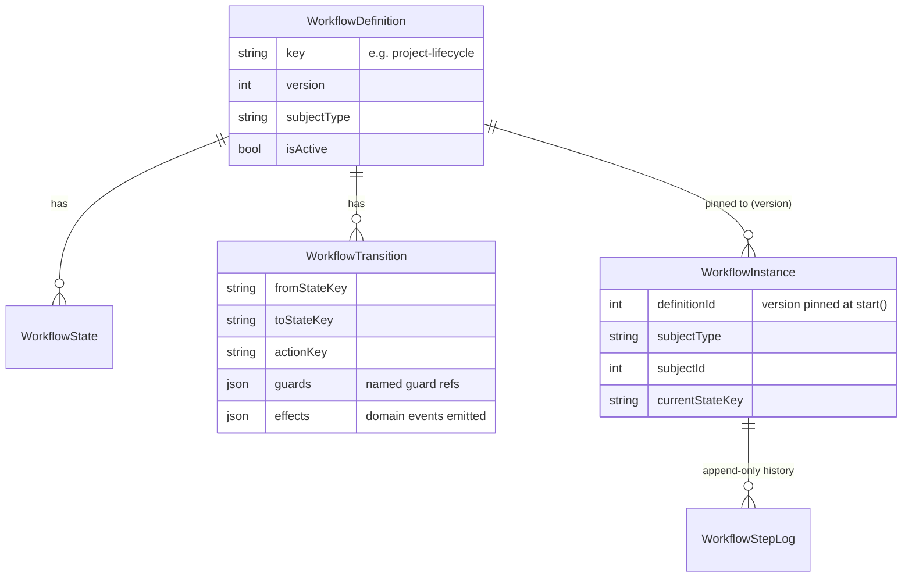
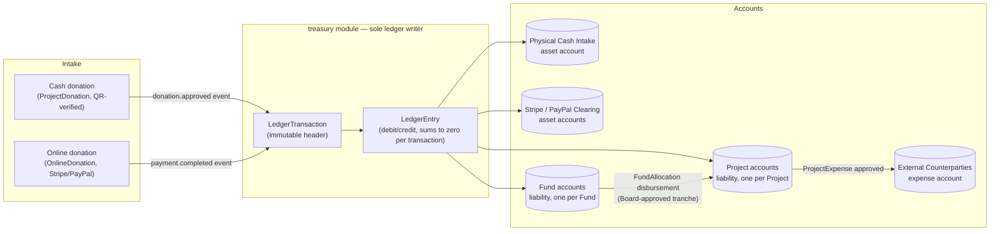
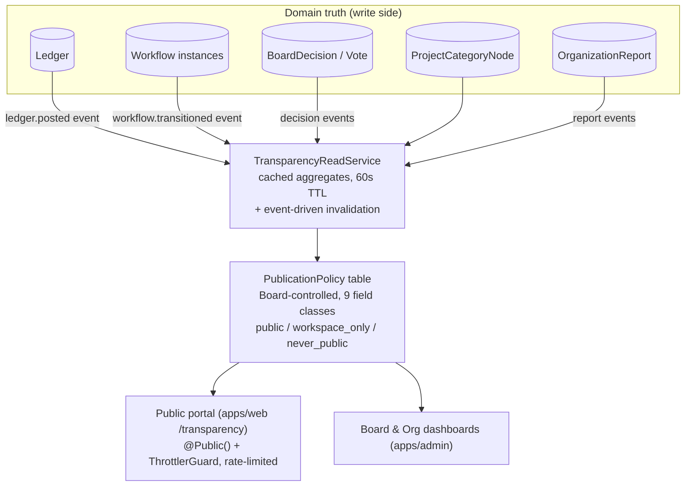
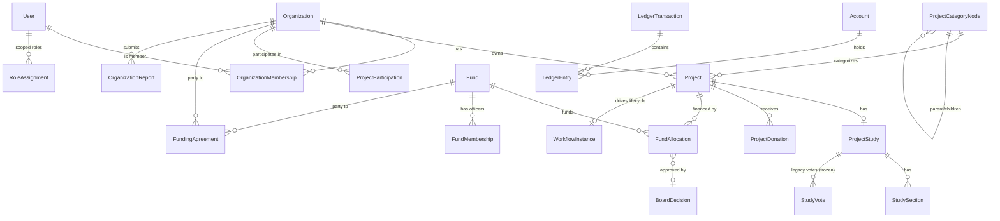
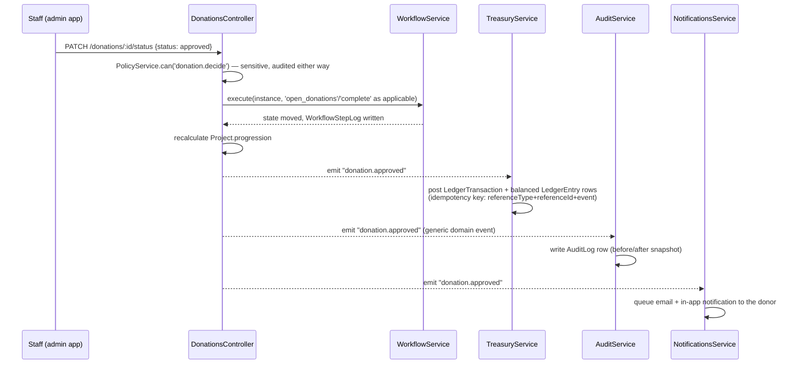

# System Architecture

> **Audience:** Developers, DevOps/infrastructure engineers, technical auditors.
> **Scope:** Reflects the codebase on branch `workspaceandcenterbox` after Waves 0–7 (all epics implemented, in soak/verification per `workspaceroadmap/PROGRESS.md`). Wave 8 (Final Consolidation) has **not started**.
> **Ground truth:** This document was written by reading `packages/database/prisma/schema.prisma`, `apps/api/src/modules/**`, `apps/admin/src/app/**`, `apps/web/src/app/**`, `docker-compose.yml`, and the three app Dockerfiles directly — not by trusting older docs, several of which (see notes below) are stale.

---

## 1. High-level shape

HelpingHands is a **modular monolith**: one NestJS API deployable, two Next.js frontends, one PostgreSQL database, one Redis instance for job queues. This is a deliberate architectural decision (`workspaceroadmap/02_TARGET_ARCHITECTURE.md`): donation approval → ledger posting → progress recalculation → audit entry must complete inside one database transaction, and the team/load profile doesn't justify microservices. Module boundaries inside the API are enforced *as if* they were service boundaries (no cross-module Prisma table access, exported service interfaces only), so extraction remains possible later — but nothing is split today.

| App | Tech | Port (dev &amp; docker-compose) | Notes |
|---|---|---|---|
| `apps/api` | NestJS 10, TypeScript, Prisma 5 | **4000** | REST under `/api/v1/*` (global prefix `api` + URI versioning, default `1`). Swagger UI at `/api/docs`. |
| `apps/web` | Next.js 14 App Router, next-intl | **3200** | Public site + participant auth + Transparency Portal. `en`/`ar`/`fr`, `localePrefix: as-needed`. |
| `apps/admin` | Next.js 14 App Router, custom i18n context | **3001** | Platform / Organization / Board workspaces. `en`/`ar`/`fr` via a hand-rolled `LanguageProvider`, not next-intl. |
| `packages/database` | Prisma schema + migrations + seed | — | Shared by all apps that touch the DB (only `apps/api` at runtime; `apps/admin`/`apps/web` never touch Prisma directly). |

> **Note on stale docs:** `docs/07-local-setup.md`, `docs/08-docker.md`, `LOCAL_SETUP.md`, `DEV_TEAM_SETUP.md` all say the web app runs on port 3000; `TEAM_SETUP.md` says 3002. **Neither is correct today.** `docker-compose.yml`, `apps/web/Dockerfile` (`EXPOSE 3200`), and `apps/web/package.json` (`next dev -p 3200`) all agree on **3200**. Treat this document and `DEPLOYMENT.md` as authoritative; the four docs above need a follow-up correction pass (tracked in `ROADMAP.md` → Technical Debt).

---

## 2. Module map (bounded contexts inside `apps/api`)

The target module map from `workspaceroadmap/02_TARGET_ARCHITECTURE.md` is now **implemented**, not aspirational:

### Module inventory (28 modules, 33 controllers)

| Module | Purpose | Notable dependents |
|---|---|---|
| `auth` | JWT login/register/refresh/logout, password reset, workspace-context switching (`/auth/switch-context`). Owns the three global `APP_GUARD`s. | everything |
| `policy` | The ABAC/RBAC "one authorization brain" (`PolicyService.can()`), scoped role catalog, tenancy row-scoping (`TenancyRepository`), Board cross-org read bypass. | all guarded routes, workflow guards |
| `organizations` | Org CRUD, capability flags, membership + org-scoped role grants, self-registration + verification workflow. | projects, funds, governance |
| `governance` | `BoardDecision` (immutable), generalized `VoteRound`/`Vote`, cross-org review queue. | study, voting, workflow |
| `voting` | Citizen voting on studies — now a thin layer over `governance`'s `VoteRound`. | study |
| `workflow` | The state-machine engine: `WorkflowDefinition/State/Transition/Instance/StepLog`, guard registry, effect emission. | donations, study, funds, execution |
| `treasury` | Double-entry ledger (`Account`/`LedgerTransaction`/`LedgerEntry`), sole writer, money-event subscriber. | funds, financial, transparency |
| `funds` | Fund CRUD, 5 fund-officer roles, `FundAllocation` lifecycle, funding agreements. | treasury, workflow, org-reporting |
| `financial` | Per-project budgets/expenses/manual transactions (legacy journal; reads can be ledger-backed via `TREASURY_LEDGER_READS`). | treasury |
| `projects` | Core `Project` entity, joint-project `ProjectParticipation`, project-scope grants. | workflow, categories |
| `study` | `ProjectStudy` + sections — the written justification/proposal behind a project. | governance, workflow, categories |
| `execution` | Steps/phases/tasks tracking. | workflow |
| `milestones` | Per-project milestone tracking. | — |
| `donations` | Cash/QR `ProjectDonation` requests + verification. | projects, notifications, workflow |
| `payments` | Stripe/PayPal `OnlineDonation` checkout + webhooks. | notifications |
| `org-reporting` | Formal org → Board progress/financial reports, obligation computation from funding-agreement schedules. | notifications |
| `categories` | Civic category taxonomy (`ProjectCategoryNode`), read-only/seeded. | projects, study |
| `transparency` | Read-only aggregation layer: public portal, board/org dashboards, CSV exports, Board-controlled publication policy. | treasury, org-reporting |
| `audit` | Append-only `AuditLog`, subscribes to every domain event. | everything (as a subscriber) |
| `notifications` | In-app inbox + Bull-queued email dispatch. | email |
| `blocks` | Multilingual CMS content (projects/blogs/news/events/about), the `Block`/`BlockTranslation` model. | files, languages |
| `files` | Polymorphic file uploads (local disk). | blocks, study sections |
| `languages` | Content-language registry (drives `blocks` translations — **not** the admin UI's own locale switcher). | blocks |
| `reports` | Per-project PDF (pdfkit) / Excel (exceljs) report generation. | — |
| `admins`, `participants` | Platform-staff and donor account management. | auth |
| `dashboard` | Legacy platform dashboard; headline numbers now delegate to `transparency`'s read layer. | transparency |
| `email` | SMTP (nodemailer) + the public contact form. | notifications |
| `qr` | QR code image generation (used internally by `donations`, no controller of its own). | donations |

---

## 3. Ownership rules (non-negotiable, enforced by code review / lint, not just convention)

1. **Treasury owns money.** No module writes `LedgerTransaction`/`LedgerEntry` except `treasury`. Every other module that moves money (donations, payments, funds, financial) emits a domain event; `MoneyEventsSubscriber` in `treasury` posts the ledger entries. Balances are always *derived* from entries, never stored-and-edited.
2. **Workflow Engine owns lifecycle state** (when `WORKFLOW_ENFORCED=true`, which is the current default). No service flips a status column directly — it calls `WorkflowService.execute(instance, action, actor)`. The engine dual-writes the legacy enum columns so old readers keep working during the transition (see §6).
3. **Policy engine owns authorization answers.** Controllers, workflow guards, and query scoping all ask the same `PolicyService.can(actor, action, resource)`. No module re-implements permission checks from scratch.
4. **Audit is a subscriber, not a call site.** Modules emit domain events (`donation.approved`, `board.decision.recorded`, `allocation.disbursed`, …); `audit` records them append-only. A developer cannot "forget" to audit an action if it went through the event bus correctly.
5. **Content (`blocks`) is presentation, not domain.** A project *has* a content block for its public-facing translated page; the project's own financial/lifecycle data does not live in `Block`.

---

## 4. Authentication & authorization

### 4.1 Request pipeline

Two authorization systems coexist by design (`workspaceroadmap/08_PERMISSIONS_RBAC_ABAC.md`), one superseding the other via a feature flag:

**A. Legacy flat roles** — `AdminRole` enum (`administrator | employee | financial_officer`) plus the literal `'participant'`. Every controller still carries `@Roles(...)` decorators using these four values; this is what `RolesGuard` reads.

**B. Scoped role catalog** — `RoleAssignment(userId, role, scopeType, scopeId)`, `scopeType ∈ {platform, organization, fund, project}`:

| Scope | Roles |
|---|---|
| `platform` | `board_chair`, `board_member`, `board_secretary`, `platform_auditor` |
| `organization` | `org_admin`, `project_manager`, `staff`, `org_accountant`, `viewer` |
| `fund` | `fund_director`, `fund_deputy`, `fund_secretary`, `fund_accountant`, `fund_controller` |
| `project` | `project_lead`, `contributor`, `financial_delegate` |

A legacy→scoped translation table (`LEGACY_ROLE_GRANTS`) lets `PolicyService` answer authorization questions for routes that don't yet have an explicit `POLICY_REGISTRY` entry:
`administrator → board_chair@platform + org_admin@organization` · `employee → staff@organization` · `financial_officer → org_accountant@organization` · `'participant' → is_participant condition`.

This is why the seeded `admin@helpinghands.org` account can open both the Platform Workspace **and** the Board tab, and why `hasBoardWorkspace` (the flag the admin frontend uses to decide platform-vs-org workspace) is true for **any** platform-scope grant — Board *or* ordinary platform staff — not only the four Board-specific roles.

### 4.2 Tenancy (multi-org data isolation)

Row-level scoping, not schema-per-tenant (`workspaceroadmap/05_ORGANIZATIONS_AND_MULTI_TENANCY.md`) — one Postgres schema, filtered by `Organization.id` at the repository layer. Enforced by `TenancyRepository` (`apps/api/src/modules/policy/tenancy.repository.ts`) when `TENANCY_ENFORCED=true` (current default):

- `enforcedOrgId(subject)` resolves which org to filter by — `null` for public/anonymous reads, flag-off, or an **audited** Board bypass (`tenancy.bypassed` event).
- `assertProjectVisible(projectId)` guards both reads and writes: a cross-org id resolves as **404**, never 403 — so a user cannot even confirm another organization's data exists.
- Creation ownership always comes from `ActorContext.activeOrgId`, never from a request-body field — no `organizationId` field exists on any create DTO.
- Board read-everywhere (`BOARD_READ_ROLES = [board_chair, board_member, board_secretary, platform_auditor]`) is an explicit, audited policy grant — not an unscoped query left over by accident.

### 4.3 Workspace routing (frontend)

`apps/admin` has **no Next.js middleware** — all workspace routing is client-side, driven by two fields the backend returns from `GET /auth/contexts`: `hasBoardWorkspace: boolean` and a list of org `contexts`. `workspaceType = hasBoardWorkspace ? 'platform' : 'organization'`. Two layout guards (`app/(dashboard)/layout.tsx` and `app/org/layout.tsx`) redirect a user to the correct workspace home and refuse to mount the other workspace's pages. See `USER_MANUAL.md` §2 for the full workspace map.

---

## 5. Workflow Engine

The workflow engine (`workflowroadmap/04_WORKFLOW_ENGINE.md`, delivered Wave 4) turns lifecycle logic that used to be hardcoded Prisma enums + service `if` statements into **versioned, data-driven state machines**.

Three operations only: `start(subject, definitionKey)`, `availableTransitions(instance, actor)`, `execute(instance, actionKey, actor, payload)` — the last one atomic (guards re-checked, state moved, `WorkflowStepLog` row written, effects emitted, all in one DB transaction).

Guard types (delegating role/capability checks to the policy engine — "one authorization brain, two entry points"):

| Guard type | Meaning |
|---|---|
| `role` | actor holds one of the listed roles at the listed scope |
| `capability` | the subject's owning organization has a given capability flag set |
| `vote_passed` | the associated `VoteRound` closed with a passing tally |
| `board_decision` | a `BoardDecision` with the required outcome exists for this subject |
| `sections_complete` | (v2 only) all required study sections are marked complete |
| `window_open` | a time-window field (e.g. voting) is open/closed as required |
| `documents_present` | required `File` rows exist on the subject (org-verification) |

### Definitions seeded today (all `isActive: true`)

| Definition | subjectType | Purpose |
|---|---|---|
| `project-lifecycle` **v1** | `project` | 1:1 transcription of the original `StudyStatus` machine: `draft → in_review → published → voting_open → voting_closed → approved/rejected → donations_open → executing → completed`. Used by every project that predates Wave 4/6 or belongs to an org without `requiresBoardOversight`. |
| `project-lifecycle` **v2** | `project` | Adds a `board_review` state between `voting_closed` and `approved`, plus capability guards (`canOpenDonations`, `canExecuteProjects`) and a direct `approved → executing` path for agreement-funded projects that never open public donations. Selected at `start()` for organizations with `requiresBoardOversight: true` (typically municipalities). Running v1 instances are never migrated to v2. |
| `emergency-relief` **v1** | `project` | Board-only fast-track: `draft → board_review → approved → executing → completed`, no public voting. |
| `org-verification` **v1** | `organization` | `submitted → under_review → verified → active` (or `rejected`), gated on `documents_present` + a Board `approved` decision. |
| `fund-allocation` **v1** | `fund_allocation` | `proposed → board_approved → disbursing → reconciled → closed` (or `rejected`), gated on Board decisions and fund-officer roles. |

> **Documentation note:** the seed file's header comment still says "all other definitions ship authored but inactive," but every definition in the current `WORKFLOW_DEFINITIONS` array carries `isActive: true` with an inline `// ACTIVATED in Wave X` comment. Treat the table above, not the header comment, as current.

`WORKFLOW_ENFORCED=true` (current default) means services actually call `execute()`; `WORKFLOW_SERVICES` can narrow enforcement to a comma-list of services (`study,voting,projects,execution`) for staged rollout — it is read directly from `process.env` but is **not yet documented as a settable key in `.env.example`** (only mentioned in a comment), a small gap worth fixing.

---

## 6. Treasury & Funds (double-entry ledger)

- **`Account`** — one per money-holding thing: `ownerType ∈ {fund, project, provider_clearing, external}`, `kind ∈ {asset, liability, income, expense}`. Balances are always computed by summing `LedgerEntry` rows — never stored as a mutable field.
- **`LedgerTransaction`** (immutable header) + **`LedgerEntry`** (immutable lines, must sum to zero per transaction) — corrections are new reversing transactions, never edits or deletes. Idempotency key: `(referenceType, referenceId, event)` — so a replayed webhook or duplicate approval cannot double-post.
- **`FundAllocation`** — fund → project financing: `proposed → board_approved → disbursing → reconciled → closed` (runs on the `fund-allocation` workflow definition). `approvedByDecisionId` links to the `BoardDecision` that authorized it. May reference a `FundingAgreement` whose terms (`blockDisbursementsOnOverdueReports`) can hold disbursement until an overdue organization report is submitted.
- **Existing donation UX is unchanged.** `ProjectDonation` (QR/cash) and `OnlineDonation` (Stripe/PayPal) keep their tables, endpoints, and screens exactly as before Wave 5 — the *only* addition is that their approval/completion handlers now also emit a domain event that Treasury consumes to post ledger entries. Donors and staff notice nothing different.
- **`ProjectTransaction`** (the old free-form per-project journal) is frozen read-only once the Wave 5 ledger backfill completes; `TREASURY_LEDGER_READS=true` (current default) switches project financial-summary reads from that legacy table to the ledger. It will be dropped in Wave 8.
- **Fund officer segregation of duties is structural**: `fund_controller` can read and flag entries but holds no approve/disburse permission by design — enforced by the policy engine, not convention.

---

## 7. Governance (the Board)

The Board is **not a separate application** — it is `Organization(type=board)` (exactly one active instance, seeded as "HelpingHands Board"), and Board members are ordinary `OrganizationMembership` rows whose users additionally hold `platform`-scope `RoleAssignment`s (`board_chair`, `board_member`, `board_secretary`, `platform_auditor`). This buys membership management, audit, and workspace UX "for free" instead of building a parallel subsystem.

- **`BoardDecision`** (immutable): `subjectType ∈ {project, project_study, fund_allocation, organization, policy}`, `decision ∈ {approved, rejected, changes_requested}`, mandatory `rationale`. Consumed as a workflow guard (`{type: "board_decision", decision: "approved"}`) — the subject's lifecycle literally cannot advance without the matching decision row.
- **`VoteRound` / `Vote`** (generalizes the original study-only voting): `eligibility` and `rules` (quorum/threshold) are policy expressions stored as JSON; today's default (`{"type": "authenticated"}`, empty `rules`) reproduces the original "any authenticated user, tally-only, humans decide" behavior. The legacy `StudyVote` table is frozen after migration and dropped in Wave 8.
- **Review queue** is a *query*, not a parallel bookkeeping table — it lists workflow instances sitting in states whose transitions carry a `board_decision` guard.

---

## 8. Reporting & Transparency (Wave 7 — read-only, no new domain truth)

- **One read layer serves both audiences.** `TransparencyReadService` computes cached aggregates over the ledger, workflow, governance, and category tables — the same numbers back the public portal and the internal Board/org dashboards. The legacy `dashboard/stats` platform headline now *delegates* to this layer rather than computing its own numbers.
- **Publication policy is Board-controlled data, not code.** `PublicationPolicy(fieldClass, visibility)` — 9 seeded field classes (see `DEMO_DATA.md` for the full table). `visibility ∈ {public, workspace_only, never_public}`; `never_public` (beneficiary personal data) is **hard-excluded at the query level** — the read layer never selects donor/participant identity columns or study section content for social-support-tree projects, and this cannot be changed by flipping a policy row.
- **Rate limiting**: `ThrottlerGuard` is applied explicitly to the public transparency and export routes (burst 20 req/s, sustained 200 req/min per IP) via `@UseGuards(ThrottlerGuard)` on those controllers specifically — **not globally**. See §10 for what this means for the rest of the API (notably `/auth/*`).
- **Exports**: RFC-4180 CSV, computed straight from ledger queries (fund statements, project statements, org annual summaries) so they reconcile with treasury balances by construction. No PDF export exists at this layer (project PDF/Excel reports are a separate, older feature in the `reports` module).

---

## 9. Data model summary

The full authoritative schema is `packages/database/prisma/schema.prisma` (1,476 lines, ~45 models). Selected relationship overview:

### Structural debt still open (tracked as D1–D5, `workspaceroadmap/01_CURRENT_SYSTEM_ANALYSIS.md`)

These are **known, intentional, and temporary** — the migration playbook (`09_MIGRATION_AND_BACKWARD_COMPATIBILITY.md`) requires additive changes through Wave 7 and reserves all drops for Wave 8.

| ID | Debt | Current state | Closes in |
|---|---|---|---|
| D1 | Execution/financial tables (`ProjectStep`, `Phase`, `Task`, `Budget`, `Expense`, `Transaction`, `Milestone`) FK to `Block`, not `Project` | Repaired additively — each table now also has a `projectRefId → projects.id` twin, populated and used by new code. Legacy Block-FK column stays until Wave 8. | Wave 8 |
| D2 | Assignee/creator columns FK to `Admin`, not `User` | Repaired additively — `*UserId` twins added (`assignedToUserId`, `createdByUserId`, etc.), backfilled from `Admin → User`. | Wave 8 |
| D3 | Lifecycle states as hardcoded Prisma enums | Repaired by the Workflow Engine (§5) — engine dual-writes the legacy enum columns (e.g. `Project.category`, `Project.studyStatus`) so old readers stay correct. | Wave 8 |
| D4 | `onDelete: Cascade` + hard deletes on domain relations | Repaired Wave 0 — new tables use `Restrict` + soft-delete columns (`deletedAt`/`deletedBy`). `SOFT_DELETE_ENFORCED` flag currently **false** (legacy hard-delete behavior still active pending a staging soak). | Wave 0 (code) / pending ops flip |
| D5 | Global 3-value `AdminRole` enum, no scope dimension | Repaired by the scoped `RoleAssignment` catalog (§4.1); `AdminRole` remains the enforced mechanism while `POLICY_ENFORCED` stays the rollback switch. | Wave 8 |

---

## 10. Known gaps and NOT IMPLEMENTED items

Documented explicitly rather than glossed over, per this doc set's "never invent features" rule:

| Item | Status |
|---|---|
| `/health` or `/healthz` endpoint | **NOT IMPLEMENTED.** No `@nestjs/terminus`, no health route anywhere in `apps/api`. `docker-compose.yml` has Docker-level healthchecks only for `postgres`/`redis`; `api`/`web`/`admin` have none. |
| Global auth rate limiting | **Configured but not enforced globally.** `ThrottlerModule` is registered with sane limits and `@Throttle()` decorators exist on `/auth/login`, `/auth/activate-invite`, `/auth/forgot-password` — but `ThrottlerGuard` is only actually applied (via `@UseGuards`) on the Wave 7 public transparency/export controllers, not globally or on `AuthController`. This is tracked as **BUG-2** (open) in `workspaceroadmap/backlog/BACKLOG_BUGS.md` and flagged as a pilot blocker in `PILOT_READINESS.md`. |
| Kubernetes / Terraform / Fly / Railway / Procfile | **NOT IMPLEMENTED.** No IaC of any kind in this repository. |
| CD / automated deploy pipeline | **NOT IMPLEMENTED.** The single GitHub Actions workflow (`e2e.yml`) runs API lint + e2e tests only — no build, no image push, no deploy step. |
| Automated rollback tooling | **NOT IMPLEMENTED.** Rollback today means manually restoring a `pg_dump` and/or flipping a feature-flag env var back — see `BACKUP_RECOVERY.md`. |
| Postgres Row-Level Security (RLS) | **NOT IMPLEMENTED.** Planned as a Wave 8 hardening item (tenancy backstop layer 3); today's isolation is application-layer only (§4.2). |
| Camera-based QR scanning in the admin app | **NOT IMPLEMENTED as a camera scan.** The "Scan QR" button opens a text box; staff paste/type the token or full donation URL. See `USER_MANUAL.md`. |
| SMTP / real payment credentials in this environment | **Placeholders only.** `.env.example` ships dev secrets and `sk_test_...` Stripe keys. Must be rotated before any pilot/production exposure (see `DEPLOYMENT.md` and `PILOT_READINESS.md`). |
| Board Member / Secretary / Auditor self-service assignment UI | **NOT IMPLEMENTED.** These `platform`-scope roles beyond `board_chair` (auto-granted to `administrator`) currently require direct database/seed intervention — no admin-app screen grants them. |
| Participant self-service profile editing | **Broken (BUG-7, open).** `User.adminId`/`User.participantId` are never populated on account creation, so `participant.user` is always null — the profile-update check for "is this the owner" fails even for the owner. The same missing relation also silently skips donation-approval emails. Needs a backfill migration + a write-path fix; tracked in `ROADMAP.md` → Technical Debt. |

---

## 11. Event flow (illustrative example: cash donation approval)

This is the concrete illustration of the ownership rules in §3: one HTTP call, one service (`DonationsService`) orchestrating the request, but three independent subscribers (Treasury, Audit, Notifications) reacting to the same domain event without the donations module knowing anything about ledgers, audit rows, or email templates.

---

## Related documents
- `BUSINESS_FLOW.md` — the end-to-end civic process this architecture supports.
- `DEPLOYMENT.md` — how to actually stand this system up.
- `DEMO_DATA.md` — the concrete seeded rows referenced throughout this document.
